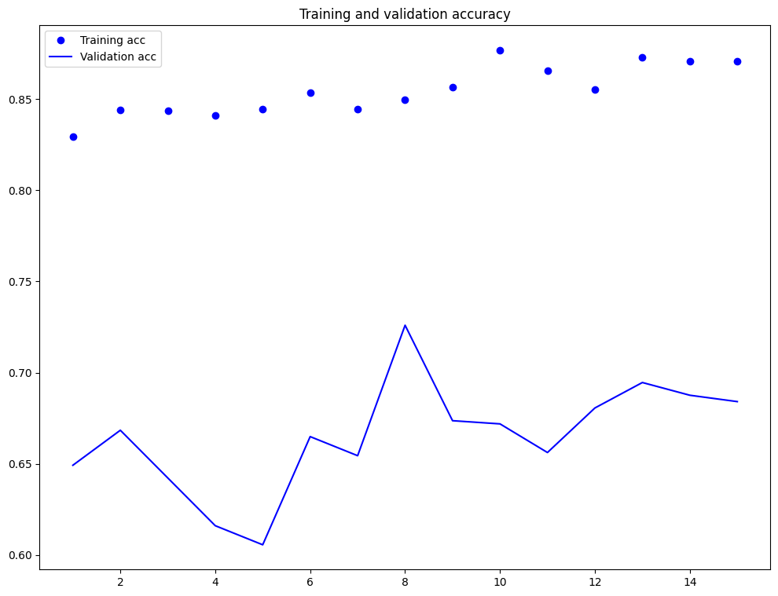
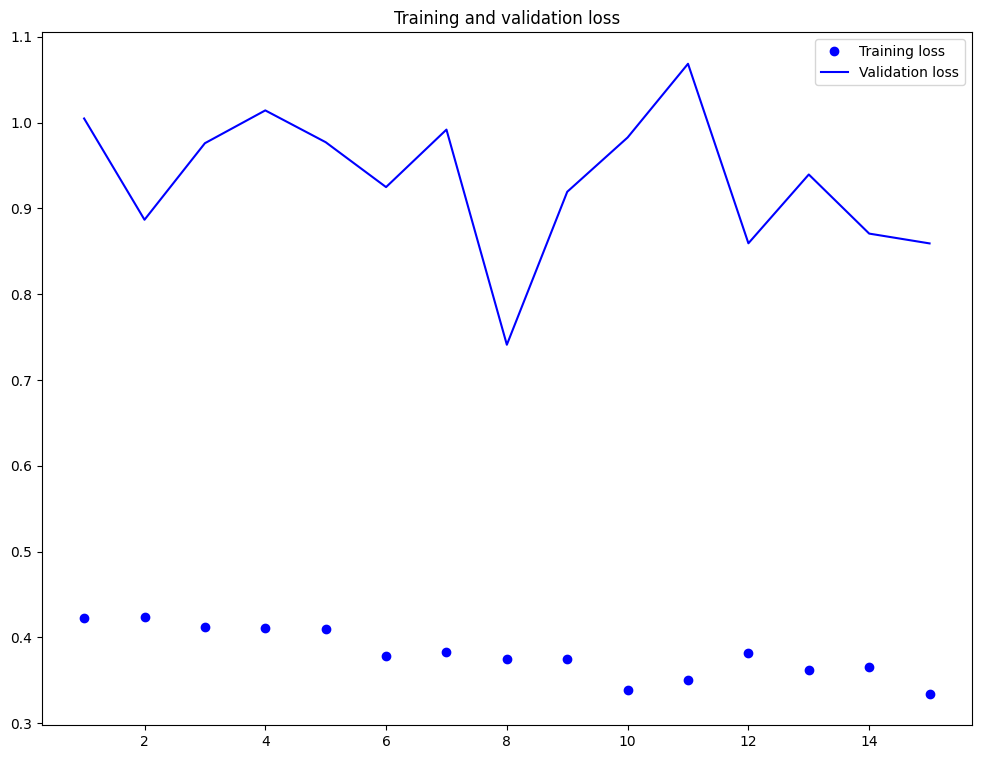

# Brain Tumor Detection Using Deep Learning

This repository contains implementations of three deep learning models for detecting and classifying brain tumors using MRI brain scans. This project compares the effectiveness of different architectures in assisting medical diagnostics.

## Table of Contents
- [Overview](#overview)
- [Models](#models)
- [Dataset](#dataset)
- [Requirements](#requirements)
- [Installation](#installation)
- [Usage](#usage)
- [Results](#results)
- [Contributing](#contributing)
- [License](#license)

## Overview

Brain tumor detection is essential for early intervention, and deep learning offers promising results in MRI analysis. This project compares three models:
1. **Custom Convolutional Neural Network (CNN)**
2. **VGG16 Transfer Learning**
3. **ResNet50 Transfer Learning**

## Models

### 1. Custom CNN with Caltech101
- **Dataset**: Caltech101, tailored for brain tumor classification
- **Architecture**: Custom CNN optimized for brain imaging
- **Training**: Uses data augmentation

### 2. VGG16 Transfer Learning
- **Architecture**: VGG16 with modified layers for binary classification
- **Pre-trained on**: Large datasets, fine-tuned for MRI
- **Advantages**: Adapted for tumor classification

### 3. ResNet50 Transfer Learning
- **Architecture**: ResNet50 with skip connections for better gradient flow
- **Training**: Fine-tuned specifically for medical imaging
- **Advantages**: Enhanced performance via skip connections

## Dataset

The models are trained and evaluated on a brain MRI dataset. Use the provided dataset or configure paths in the configuration file if using a custom dataset.

## Requirements

All required packages are listed in `requirements.txt`. Install them as follows:

```bash
pip install -r requirements.txt
```

## Installation

1. Clone the repository:
   ```bash
   git clone https://github.com/Brain-Tumor-Detection/BrainTumorDetection.git
   cd Brain-Tumor-Detection
   ```

2. Install dependencies:
   ```bash
   pip install -r requirements.txt
   ```

3. Download and place the dataset in the specified folder.

## Usage

1. **Run the Notebooks in Jupyter**:
   - Open each notebook in Jupyter Notebook or JupyterLab to run the models:
     - `Custom_CNN_Training.ipynb`
     - `VGG16_Transfer_Learning.ipynb`
     - `ResNet50_Transfer_Learning.ipynb`

2. **Command Line Execution**:
   - You can run the notebooks from the command line by converting them to Python scripts:
     ```bash
     jupyter nbconvert --to script Custom_CNN_Training.ipynb
     python Custom_CNN_Training.py
     ```

3. **Evaluate Model**:
   - Convert the evaluation notebook to a script or run directly in Jupyter:
     ```bash
     jupyter nbconvert --to script evaluate_model.ipynb
     python evaluate_model.py
     ```

### Configuration
Update configuration files to specify training parameters like learning rate, batch size, and data paths.

## Results

Training and validation loss metrics are visualized below:





## Contributing

Fork the repository, make changes, and submit a pull request. Ensure code is documented and tested.

## License

Licensed under the MIT License. See the LICENSE file for more details.
